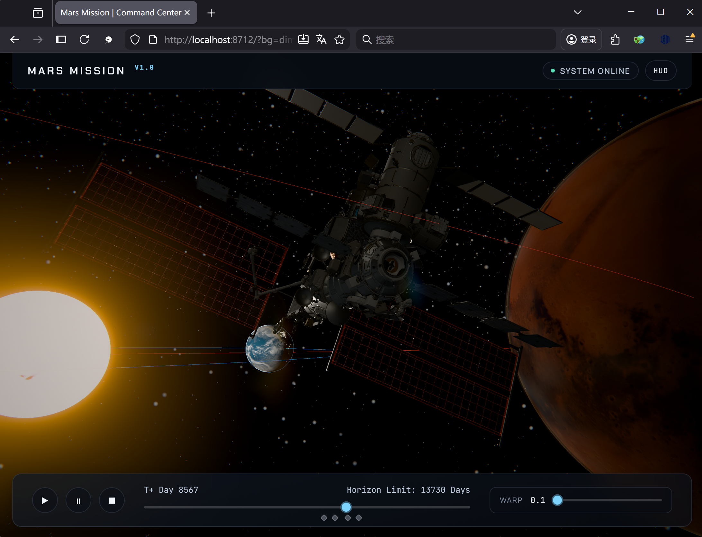

# 火星往返任务 3D 可视化（Mars Mission 3D Visualization）

Vibe Programming实现的交互式 3D 火星往返任务可视化演示：后端使用 FastAPI 提供轨道/任务数据，并通过 WebSocket 实时推送；前端使用 Three.js 渲染太阳、行星、飞船与视觉效果。



## 快速开始

```bash
# 安装依赖
pip install -r requirements.txt

# 运行自检（可选但推荐）
python3 test.py

# 启动服务（会自动寻找可用端口，默认从 8712 开始）
./start.sh

# 浏览器打开（以控制台输出的端口为准）
http://localhost:8712
```

## 功能特性

- **真实（近似）轨道参数**：使用 JPL 数据的近似轨道根数（偏心率/倾角/周期等）计算地球与火星位置
- **任务阶段**：发射等待 → 地火转移 → 火星停留 → 火地转移 → 完成
- **实时仿真**：WebSocket 推送 `update`/`snapshot`，前端即时更新渲染与信息面板
- **交互式 3D**：鼠标旋转/平移/缩放，多种视角跟随（地球/火星/飞船/俯视/自由），支持平滑插值过渡
- **视觉效果**：Bloom泛光、大气Fresnel、镜头Bokeh、星球纹理、凹凸贴图、飞船精模、推进粒子、银河带/星尘、星云、轨迹尾迹、20Hz物理数据平滑插值渲染
- **信息展示**：实时坐标、地火距离、速度与进度条，支持时间轴拖动回放

## 项目结构

```
mars_mission/
├── backend/
│   ├── main.py              # FastAPI 服务 + WebSocket
│   └── orbit_engine.py      # 轨道/任务阶段计算
├── frontend/
│   ├── index.html           # 页面与脚本加载
│   ├── styles.css           # 样式
│   ├── main.js              # Three.js 场景与渲染
│   ├── orbit.js             # 轨道/尾迹工具（可选）
│   ├── spacecraft.js        # 飞船模型与效果
│   ├── controls.js          # 控件与快捷键
│   └── ui.js                # 信息面板更新
├── requirements.txt         # Python 依赖
├── start.sh                 # 一键启动（自动选择端口）
└── test.py                  # 基本自检脚本
```

## 安装与运行

1. 安装 Python 依赖：
   ```bash
   pip install -r requirements.txt
   ```

2. 启动服务（推荐）：
   ```bash
   ./start.sh
   ```

   或手动指定端口：
   ```bash
   cd backend
   python3 main.py --port 9000
   ```

3. 浏览器访问控制台提示的地址，例如：
   ```text
   http://localhost:8712
   ```

## 操作说明

**3D 视角：**
- 左键拖动：旋转
- 右键拖动：平移
- 滚轮：缩放

**仿真控件：**
- Start：开始仿真
- Pause：暂停/继续
- Stop：复位到初始状态
- Time Speed：调整仿真推进速度
- Timeline：拖动时间轴进行回放/快进
- View Mode：切换视角（自由/跟随地球/跟随火星/跟随飞船/俯视）

**键盘快捷键：**
- Space：暂停/继续
- ← / →：按天回退/前进
- R：复位
- C：切换视角（循环）
- F：全屏切换

## 接口

### REST API

- `GET /`：返回前端页面（`frontend/index.html`）
- `GET /api/mission/info`：任务参数与总时长
- `GET /api/planets`：行星轨道参数摘要
- `GET /api/orbit/{planet}`：生成轨道采样点（`earth` / `mars`）
- `GET /api/state`：当前仿真状态（是否运行/时间/速度/是否暂停）
- `GET /api/snapshot`：当前时刻系统快照（行星/飞船位置等）

### WebSocket

- `WS /ws`：实时推送仿真数据（`init`、`update`、`snapshot` 等）

## 坐标与单位说明

- 后端 `backend/orbit_engine.py` 输出坐标为 `(x, y, z)`，位置单位为 **AU**，时间单位为 **day**，速度为 **AU/day**（数值由差分估计）。
- Three.js 默认 **Y 轴向上**。为使“轨道平面”视觉上更贴合直觉，前端渲染时会将后端坐标映射为 **`(x, z, y)`**（也就是把后端的 `z` 映射到 Three 的 `y`）。
- 信息面板（`frontend/ui.js`）展示的是后端原始 `(x, y, z)` 数据；渲染使用的是映射后的坐标。

## 技术细节

### 行星轨道参数（示例）

- **地球**：半长轴 ~1.000 AU，偏心率 ~0.0167，倾角 ~0.000°，周期 ~365.25 天
- **火星**：半长轴 ~1.524 AU，偏心率 ~0.0934，倾角 ~1.850°，周期 ~687.0 天

### 任务时间线（默认参数）

- 地球→火星：~259 天
- 火星停留：~454 天
- 火星→地球：~259 天
- 单次任务总时长：~972 天

## 自定义与开发

### 调整任务参数

编辑 `backend/orbit_engine.py`（例如）：

```python
self.transfer_time_earth_mars = 259  # days
self.transfer_time_mars_earth = 259  # days
self.mars_wait_time = 454  # days
```

### 调整视觉效果

可在 `frontend/main.js` 调整 Bloom 等效果参数，例如：

```javascript
this.bloomPass = new THREE.UnrealBloomPass(
  new THREE.Vector2(window.innerWidth, window.innerHeight),
  2.0, // strength
  0.8, // radius
  0.5  // threshold
);
```

## 排障

### WebSocket 连接失败

- 确认后端服务正在运行
- 确认端口未被占用（`start.sh` 会自动递增端口）
- 检查浏览器控制台/网络面板是否有被拦截或断开

### 3D 场景无法加载

- 打开浏览器控制台查看报错
- 确认浏览器允许加载脚本（Three.js 等库通过 CDN 引入）
- 建议使用 Chrome / Firefox

### 性能问题

- 降低 Time Speed（减少每帧变化幅度）
- 适当调低 Bloom 强度
- 关闭其他高负载标签页

## License

本项目用于学习与演示目的。

## Credits

- 轨道参数参考：NASA JPL（近似）
- Three.js：three.js contributors
- 后端：FastAPI / Uvicorn

## 联系方式

如有问题或建议，请在项目仓库提交 issue。 
