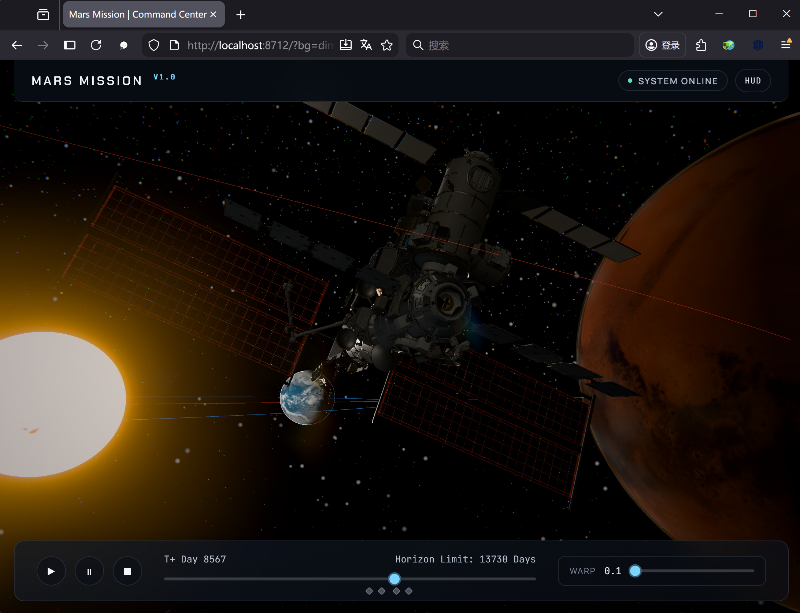

# Mars Mission 3D Remastered

Vibe Anything! [kcores-llm-arena火星任务](https://github.com/KCORES/kcores-llm-arena/tree/main/benchmark-mars-mission) 3D超高清重制版：

- 后端：FastAPI + WebSocket，提供轨道与任务阶段数据
- 前端：Three.js（CDN importmap）渲染太阳系、轨迹与飞船，并提供控制台 UI



---

## 1. 功能概览

- 行星轨道与飞船转移轨迹的实时可视化（位置单位 AU，时间单位 day）
- 动态任务阶段：发射等待 → 地火转移 → 火星停留 → 火地转移
- 播放/暂停/复位、拖动时间轴、调整推进速度（Warp）
- 多视角相机：自由 / 跟随地球 / 跟随火星 / 跟随飞船 / 俯视

---

## 2. 项目结构与运行方式

### 2.1 后端（FastAPI）

- 入口：`backend/main.py`
- 静态资源：挂载 `frontend/` 到 `/static/*`
- WebSocket：`/ws`（`init` / `update` / `snapshot`）
- 仿真循环：后台任务持续运行，按 20 FPS 推进并广播（运行且未暂停时）

### 2.2 前端（无构建链）

- 页面：`frontend/index.html`
- 脚本：`frontend/main.js` / `frontend/spacecraft.js` / `frontend/ui.js` / `frontend/controls.js`
- Three.js 与 examples：通过 CDN importmap 加载（见 `frontend/index.html`）
- 无 Node/npm、无 bundler

---

## 3. 环境要求

### 3.1 必需
- Python 3.10+（建议）
- 浏览器：Chrome / Firefox

### 3.2 网络要求
默认需要外网访问：
- 前端 Three.js 与 examples 从 CDN 加载（`frontend/index.html`）
- NASA Gateway Core 飞船模型在首次启动时可自动下载（见下文）

---

## 4. 快速开始

### 4.1 使用 venv（推荐）
```bash
python3 -m venv .venv
source .venv/bin/activate
python3 -m pip install -r requirements.txt
python3 test.py
./start.sh
```

### 4.2 使用 Conda（可选）
```bash
conda create -n mars_mission python=3.10
conda activate mars_mission
python -m pip install -r requirements.txt
python test.py
./start.sh
```

启动后按控制台提示打开浏览器，例如：
```text
http://localhost:8712/?cfg=preset.cfg
```

---

## 5. 启动与测试

### 5.1 一键启动（推荐）
```bash
./start.sh
```

说明：
- 自动从 `8712` 开始寻找空闲端口
- 若检测不到 FastAPI 依赖，会执行 `pip install -r requirements.txt`
  - 建议在 venv/conda 中运行，避免安装到全局 Python

### 5.2 手动启动（指定端口）
```bash
cd backend
python3 main.py --port 8712
```

### 5.3 自检
运行完整自检：
```bash
python3 test.py
```

只跑单个测试函数（避免 `test` 模块名冲突）：
```bash
python3 -c "import runpy; ns=runpy.run_path('test.py'); ns['test_dependencies']()"
python3 -c "import runpy; ns=runpy.run_path('test.py'); ns['test_frontend_files']()"
python3 -c "import runpy; ns=runpy.run_path('test.py'); ns['test_orbit_engine']()"
python3 -c "import runpy; ns=runpy.run_path('test.py'); ns['test_fastapi_import']()"
```

---

## 6. 操作说明（前端）

### 6.1 3D 视角（鼠标）
- 左键拖动：旋转
- 右键拖动：平移
- 滚轮：缩放

### 6.2 控制台 UI
- 底部控制条：Start / Pause / Reset、Warp（速度）、Timeline（时间轴）
- 右侧面板：View Mode（视角切换）、Model Calibration（Yaw/Pitch/Roll）
- 顶部：HUD 按钮可切换“沉浸模式”

### 6.3 键盘快捷键
- `Space`：暂停/继续
- `← / →`：按天回退/前进
- `R`：复位
- `C`：切换视角（循环）
- `F`：全屏切换
- `H`：切换 HUD

---

## 7. 飞船模型（NASA Gateway Core）

### 7.1 文件路径与命名
运行时前端会请求：
- `/static/assets/models/GatewayCore_Nasa.glb`

对应仓库路径：
- `frontend/assets/models/GatewayCore_Nasa.glb`

NASA 原始文件名包含空格（`Gateway Core.glb`），本项目统一使用无空格命名 `GatewayCore_Nasa.glb`。

### 7.2 自动下载（后端启动时）
后端启动会确保 `frontend/assets/models/GatewayCore_Nasa.glb` 存在：

- 若文件不存在：从 NASA 下载并保存（约 60+ MiB；启动会等待下载完成；控制台打印进度）
- 若文件存在但校验失败：删除并重新下载
- 若下载/校验失败：后端仍会启动；前端加载失败后会回退到程序生成（procedural）的飞船模型

下载源（后端内置）：`https://assets.science.nasa.gov/content/dam/science/cds/3d/resources/model/gateway/Gateway%20Core.glb?emrc=697ae83982ce6`

### 7.3 下载完成后的快速校验
后端会做轻量校验，避免保存到 HTML/错误文件：
- GLB 头部：magic/version/length（长度需与文件大小一致）
- 第一个 chunk：必须是 JSON 且可解析
- glTF JSON：至少包含 `asset` / `scenes` / `nodes`

### 7.4 坐标系矫正（重要）
NASA 原始模型与项目内部坐标约定存在差异。前端加载 `GatewayCore_Nasa.glb` 后会应用一次固定的“本地坐标系矫正矩阵”（见 `frontend/spacecraft.js`）。

因此：
- 不要把“已经矫正过的 GLB”也命名为 `GatewayCore_Nasa.glb`
- 否则会被重复矫正，导致姿态/旋转不正确

---

## 8. 配置（可选）

前端支持通过 URL 参数加载配置文件：

- 用法：`/?cfg=preset.cfg`
- 支持多个：`/?cfg=preset.cfg&cfg=debug.cfg`
- 配置文件目录：`frontend/config/`
- 访问路径：`/static/config/<cfg>`

---

## 9. API（后端）

### 9.1 REST
- `GET /`：返回前端页面（`frontend/index.html`）
- `GET /api/mission/info`：仿真模型元数据（时间轴范围、预览等）
- `GET /api/planets`：行星轨道参数摘要
- `GET /api/orbit/{planet}`：轨道采样点（`earth` / `mars`）
- `GET /api/state`：当前仿真状态
- `GET /api/snapshot`：当前时刻系统快照

### 9.2 WebSocket
- `WS /ws`：实时推送 `init` / `update` / `snapshot`
- 命令（前端 → 后端）：`start`、`pause`、`stop`、`set_speed`、`set_time`、`get_snapshot`

---

## 10. 坐标与单位（后端 → 前端）

- 后端输出坐标 `(x, y, z)`，单位 **AU**
- 时间单位 **day**，速度 **AU/day**
- 前端渲染坐标映射：

  **`(x, y, z)_backend → (x, z, -y)_three`**

说明：
- 信息面板展示的是后端原始坐标
- 3D 渲染使用映射后的坐标

---

## 11. 目录结构（速览）

```
mars_mission/
├── backend/
│   ├── main.py              # FastAPI 服务 + WebSocket + 模型下载/校验
│   └── orbit_engine.py      # 轨道/任务阶段计算
├── frontend/
│   ├── index.html           # 页面与 CDN importmap
│   ├── styles.css           # 样式
│   ├── main.js              # Three.js 场景与渲染主循环
│   ├── spacecraft.js        # 飞船模型加载 + 坐标系矫正
│   ├── controls.js          # UI 控件与快捷键
│   ├── ui.js                # 信息面板更新
│   ├── assets/              # 模型/贴图等静态资源
│   └── config/              # cfg 配置文件（可通过 URL 加载）
├── requirements.txt         # Python 依赖
├── start.sh                 # 一键启动（自动选端口）
└── test.py                  # 自检脚本
```

---

## 12. 常见问题（FAQ）

### 12.1 页面白屏 / 资源加载失败
Three.js 与 examples 默认从 CDN 加载；若网络/代理/防火墙阻止外网访问，会导致前端依赖无法加载。

### 12.2 启动很慢
首次启动可能会下载 `GatewayCore_Nasa.glb`（60+ MiB），属于预期行为；后端控制台会打印下载进度与校验结果。

### 12.3 飞船模型不显示
可能原因：
- NASA 模型下载失败（检查后端启动日志）
- `/static/assets/models/GatewayCore_Nasa.glb` 无法被访问（被删除/路径不一致）

模型加载失败时，前端会回退 procedural 飞船模型以保证应用可用。

---

## 13. Credits

- 地火轨道参数参考：NASA JPL（近似）
- NASA Gateway Core 3D model：由 NASA Science 3D 资源提供
- Sound SFX：You don't dream in cryo, by James Horner
- Planet/space Texture：
  * https://planetpixelemporium.com/planets.html
  * https://github.com/dawidbil/solar-system
  * https://www.solarsystemscope.com
  * http://www.celestiamotherlode.net/catalog/mars.html
